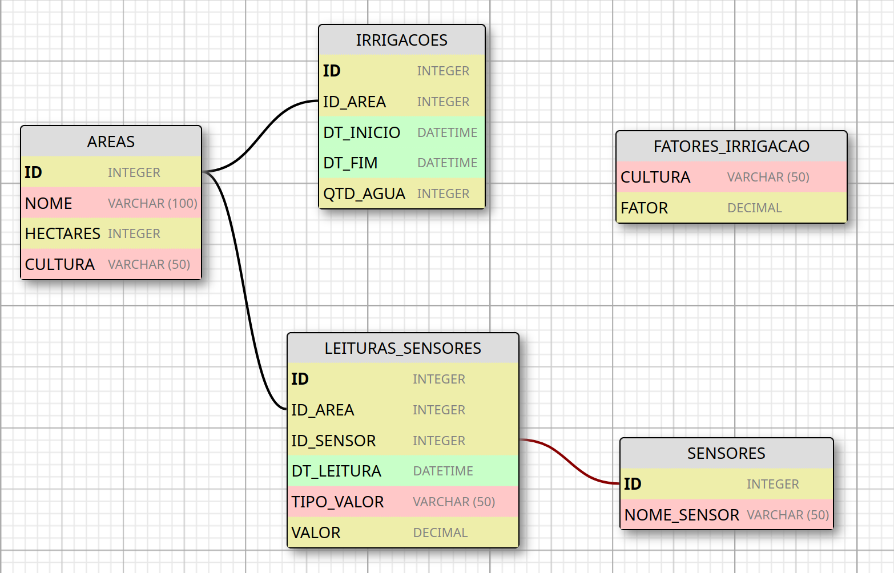

# FIAP - Atividade Cap 1 (fase 2)
__Aluno__: Marcos de Souza Trazzini (RM559926)

## Modelo Entidade-Relacionamento (MER)

### Tabela AREAS

* __Descrição:__ Armazena as informações sobre as áreas de plantio.
* __Campos:__
    * `ID` (Número de Identificação): 
        * Tipo: Simples, Determinante
        * Formato: NUMBER
        * Constraints: chave primária (auto-incrementável, IDENTITY)
        * Cardinalidade: Mínima = 1 (Obrigatório), Máxima = 1 (Monovalorado)
    * `NOME` (Nome da área): 
        * Tipo: Simples
        * Formato: VARCHAR2(100)
        * Cardinalidade: Mínima = 1 (Obrigatório), Máxima = 1 (Monovalorado)
    * `HECTARES` (Tamanho da área, em hectares):
        * Tipo: Simples
        * Formato: NUMBER
        * Cardinalidade: Mínima = 1 (Obrigatório), Máxima = 1 (Monovalorado)
    * `CULTURA` (Tipo de cultura plantada na área):
        * Tipo: Simples
        * Formato: VARCHAR2(50)
        * Cardinalidade: Mínima = 1 (Obrigatório), Máxima = 1 (Monovalorado)
* __Relacionamentos:__
    * Um para muitos com a tabela `IRRIGACOES` (Uma Área pode ter várias Irrigações).
    * Um para muitos com a tabela `LEITURAS_SENSORES` (Uma Área pode ter várias Leituras de Sensores).

### Tabela IRRIGACOES

* __Descrição:__ Armazena os processos de irrigação para cada área.
* __Campos:__
    * `ID` (Número de Idenificação):
        * Tipo: Simples, Determinante
        * Formato: NUMBER
        * Constraints: chave primária (auto-incrementável, IDENTITY)
        * Cardinalidade: Mínima = 1 (Obrigatório), Máxima = 1 (Monovalorado)
    * `ID_AREA` (Área irrigada):
        * Tipo: Simples, Chave Estrangeira(AREAS)
        * Formato: NUMBER
        * Constraints: chave estrangeira referenciando o campo `ID` da tabela `AREAS`
        * Cardinalidade: Cardinalidade: Mínima = 1 (Obrigatório), Máxima = 1 (Monovalorado)
    * `DT_INICIO` (Data e hora de início da irrigação):
        * Tipo: Simples
        * Formato: DATETIME
        * Cardinalidade: Mínima = 1 (Obrigatório), Máxima = 1 (Monovalorado)
    * `DT_FIM` (Data e hora do final da irrigação):
        * Tipo: Simples
        * Formato: DATETIME
        * Cardinalidade: Mínima = 1 (Obrigatório), Máxima = 1 (Monovalorado)
    * `QTD_AGUA` (Quantidade de água utilizada na irrigação, em litros):
        * Tipo: Simples
        * Formato: NUMBER
        * Cardinalidade: Mínima = 1 (Obrigatório), Máxima = 1 (Monovalorado)
* __Relacionamentos:__
    * Muitos para um com a tabela `AREAS` (Muitas irrigações pertencem a 1 área).

### Tabela SENSORES
* __Descrição:__ Contém os tipos de sensores instalados nas áreas.
* __Campos:__
    * `ID` (Número de Idenificação):
        * Tipo: Simples, Determinante
        * Formato: NUMBER
        * Constraints: chave primária (auto-incrementável, IDENTITY)
        * Cardinalidade: Mínima = 1 (Obrigatório), Máxima = 1 (Monovalorado)
    * `NOME_SENSOR` (Nome do Sensor):
        * Tipo: Simples
        * Formato: VARCHAR(50)
        * Cardinalidade: Cardinalidade: Mínima = 1 (Obrigatório), Máxima = 1 (Monovalorado)
* __Relacionamentos:__
    * Muitos para um com a tabela `LEITURAS_SENSORES` (Um sensor pode registrar várias leituras).

### Tabela LEITURAS_SENSORES
* __Descrição:__ Registra as leituras dos sensores instalados nas áreas.
* __Campos:__
    * `ID` (Número de Idenificação):
        * Tipo: Simples, Determinante
        * Formato: NUMBER
        * Constraints: chave primária (auto-incrementável, IDENTITY)
        * Cardinalidade: Mínima = 1 (Obrigatório), Máxima = 1 (Monovalorado)
    * `ID_AREA` (Área):
        * Tipo: Simples, Chave Estrangeira(AREAS)
        * Formato: NUMBER
        * Constraints: chave estrangeira referenciando o campo `ID` da tabela `AREAS`
        * Cardinalidade: Cardinalidade: Mínima = 1 (Obrigatório), Máxima = 1 (Monovalorado)
    * `ID_SENSOR` (Sensor):
        * Tipo: Simples, Chave Estrangeira(SENSORES)
        * Formato: NUMBER
        * Constraints: chave estrangeira referenciando o campo `ID` da tabela `SENSORES`
        * Cardinalidade: Cardinalidade: Mínima = 1 (Obrigatório), Máxima = 1 (Monovalorado)
    * `DT_LEITURA` (Data e hora da leitura do sensor):
        * Tipo: Simples
        * Formato: DATETIME
        * Cardinalidade: Mínima = 1 (Obrigatório), Máxima = 1 (Monovalorado)
    * `TIPO_VALOR` (Tipo de Leitura):
        * Tipo: Simples
        * FORMATO: VARCHAR(50)
        * Cardinalidade: Mínima = 1 (Obrigatório), Máxima = 1 (Monovalorado)
    * `VALOR` (Valor da Leitura):
        * Tipo: Simples
        * Formato: NUMBER
        * Cardinalidade: Mínima = 1 (Obrigatório), Máxima = 1 (Monovalorado)
* __Relacionamentos:__
    * Muitos para um com a tabela `AREAS` (Muitas leituras estão associadas a uma área).
    * Muitos para um com a tabela `SENSORES` (Muitas leituras estão associadas a um sensor).

### Tabela FATORES_IRRIGACAO
* __Descrição:__ Armazena o fator de irrigação por cultura.
* __Campos:__
    * `CULTURA` (Tipo de Cultura):
        * Tipo: Simples, Determinante
        * Formato: VARCHAR(50)
        * Constraints: chave primária indexada (IDENTITY)
        * Cardinalidade: Mínima = 1 (Obrigatório), Máxima = 1 (Monovalorado)
    * `FATOR` (Fator de Irrigação):
        * Tipo: Simples, Determinante
        * Formato: NUMBER
        * Cardinalidade: Mínima = 1 (Obrigatório), Máxima = 1 (Monovalorado)
* __Relacionamentos:__
    * A tabela `FATORES_IRRIGACAO` não possui relacionamentos diretos, e serve apenas para apoiar a aplicação na identificação do fator de irrigação adequado para o cálculo de quantidade de água por cultura VS tempo de irrigação.

